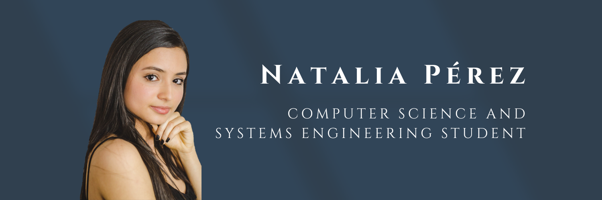
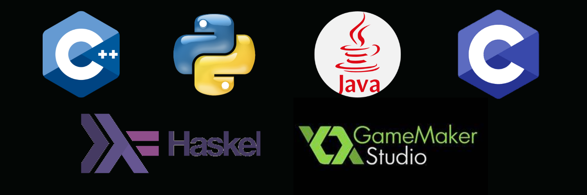

## 👋Hey there, i am Natalia👩‍💻

### About me😊

- I am a current student of Computer Science at Buenos Aires University.

- So far, I have learned about algorithms and data structures through various programming languages like Java, Python, and Haskell.

- I am constantly learning new things I am passionate about. Right now, I am learning SQL.

- In addition to coding, I have a deep love for music. I play violin and piano.

### Languages

### Here you will find...🤔

- Projects that I've worked on, which are related to what I mentioned before.

- Systems Analysis and Design Projects.
